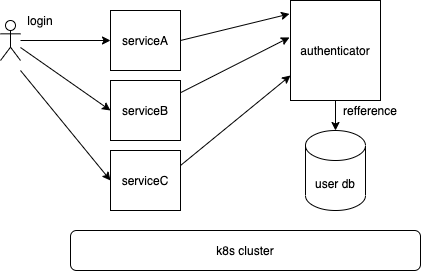

# data-platform-authenticator

## 概要
authenticator は、データ連携基盤において、任意のアプリケーション・システム・マイクロサービス等に対して、認証機能を提供するマイクロサービスです。

## システム構成図


## 事前準備
本マイクロサービスは、認証情報を維持管理するためのDBとして、MySQLを利用します。
デフォルトでは data_platform_authenticator_business_user_data テーブルを参照しますが、configs/configs.yamlに対象テーブルを指定していただければ、指定されたテーブル内容を参照します。

## セットアップ
1. リポジトリをクローンする。
```shell
$ git clone https://github.com/latonaio/data-platform-authenticator.git
$ cd data-platform-authenticator
```

2. 秘密鍵を生成する。  

```
# 秘密鍵の生成 (JWT:JSON Web Token の署名に必要)
$ make generate-pem-key-pair // 秘密鍵と公開鍵の生成

# 環境変数の設定項目
DATA_PLATFORM_AUTHENTICATOR_MYSQL_KUBE・・・Host名
MYSQL_PORT・・・mysql のポート番号
UserName・・・mysql のユーザー名
UserPassword・・・mysql のパスワード
MaxOpenCon・・・mysql の最大接続数
MaxIdleCon・・・mysql の最大アイドル接続数
MaxLifeTime・・・mysql の最大ライフタイム
Name・・・mysql のデータベース名
TableName・・・mysql のテーブル名
EXP・・・JWTの有効期限
AUTHENTICATOR_PRIVATE_KEY・・・秘密鍵
AUTHENTICATOR_PUBLIC_KEY・・・公開鍵
```

## モデル定義
### data_platform_authenticator_business_user_data テーブル
より厳密な定義を知りたい場合は DB 定義を確認してください。

```
EmailAddress・・・メールアドレス
Password・・・パスワード
qos・・・quality of service
```

`password` には入力規則があります。詳しくは入力規則の項目を参照してください。

`qos` は現状 `default`、`raw` の二つの値のどちらかを登録できます。
入力しない場合や、これら二つ以外の値を登録しようとすると `default` が設定されます。
`qos` の値を `raw` にする事で、`authenticator` の入力規則を無視した `login_id`, `password` を登録することができます。

## 利用方法
Authenticatorでは以下のAPIが利用できます。

### POST /users
ユーザー登録を行います。

#### リクエスト
ユーザー登録には下記のパラメータを指定して、 POST リクエストを送信してください。

| name          | description |
|---------------| --- |
| email_address | ユーザを識別する id (必須) |
| password      | ユーザのパスワード (必須) |
| qos           | qos の値を指定します。デフォルトでは "default" が設定されます。 |

Password の入力規則に関しては 入力規則 のセクションを参照してください

```
POST /users
Origin: http://{{host_name}}
Content-Type: application/x-www-form-urlencoded

email_address=test@test.co.jp&password=OK_password&qos=default
```

```
curl -X POST http://{{host_name}}/users -d email_address=test@test.co.jp -d password=OK_password -d qos=default
```

```
curl -X POST http://{{host_name}}/users -d email_address=test@test.co.jp -d password=okpassword -d qos=raw
```

#### レスポンス
authenticator はリクエストに対し下記のいずれかの応答をします。

| status code | description                          |
| --- |--------------------------------------|
| 200 | ユーザーの登録に成功                           |
| 400 | リクエストパラメータが不正 (入力規則を満たしているか確認してください) |
| 409 | email_address が既に登録済み or 削除されたユーザ    |
| 500 | サーバー内エラー                             |

### GET /users/login_id/{{email_address}}
ユーザー情報を取得します。

#### リクエスト
ユーザー情報の取得に GET リクエストを送信してください。

```http_request
GET /users/login_id/{{email_address}}
Origin: http://{{host_name}}
```

```
curl -X GET http://{{host_name}}/users/login_id/{{email_address}}
```

#### レスポンス
authenticator はリクエストに対し下記のいずれかの応答をします。

| status code | description |
| --- | --- |
| 200 | user 情報の返却 |
| 404 | ユーザが未登録 |
| 409 | ユーザが削除済み |
| 500 | サーバー内エラー |

ユーザーが登録されている場合、ユーザー情報を返します。

### PUT /users/login_id/{{email_address}}
ユーザー更新を行います。

#### リクエスト
ユーザー情報の更新には下記のパラメータを指定して、 PUT リクエストを送信してください。

| name | description |
| --- | --- |
| old_password | 変更前の password (必須) |
| email_address | ユーザを識別する id ( 指定しない場合は更新されません ) |
| password | ユーザ認証を行う password ( 指定しない場合は更新されません ) |
| qos | qos の値 ( 指定しない場合は更新されません ) |

password の入力規則に関しては 入力規則 のセクションを参照してください。
また、更新の際には old_password に更新前のパスワードを指定し、認可する必要があります。

```http_request
PUT /users/login_id/{{logain_id}}
Origin: http://{{host_name}}
Content-Type: application/x-www-form-urlencoded

old_password=OK_password&email_address=test@test.co.jp&password=okpassword&qos=raw
```

```
curl -X PUT http://{{host_name}}/users/login_id/{{email_address}} -d old_password=OK_password -d email_address=test@test.co.jp -d password=okpassword -d qos=raw
```

#### レスポンス

authenticator はリクエストに対し下記のいずれかの応答をします。

| status code | description |
| --- | --- |
| 200 | user の更新に成功 |
| 400 | リクエストパラメータが不正 |
| 401 | ユーザーの認証に失敗 |
| 404 | ユーザが未登録 |
| 409 | 既に削除されたユーザー |
| 500 | サーバー内エラー |

### POST /login
ユーザー認証を行います。

#### リクエスト
ユーザー認証には下記のパラメータを指定して、 POST リクエストを送信してください。
認証に成功した場合 JWT が返却されます。

| name | description |
| --- | --- |
| email_address | ユーザを識別する id (必須) |
| password | ユーザ認証を行う password (必須) |

```http_request
POST /login
Origin: http://{{host_name}}
Content-Type: application/x-www-form-urlencoded

email_address=test@test.co.jp&password=OK_password
```

```request_example
curl -X POST http://{{host_name}}/login -d email_address=test@test.co.jp -d password=OK_password
```

#### レスポンス
authenticator はリクエストに対し下記のいずれかの応答をします。

| status code | description |
| --- | --- |
| 200 | ユーザーの認証に成功 (JWT を返却)|
| 400 | リクエストパラメータが不正 |
| 401 | ユーザーの認証に失敗 |
| 404 | ユーザが未登録 |
| 409 | 既に削除済みのユーザ |
| 500 | サーバー内エラー |

認証に成功すると JWT を返却します。

```response-example
{"jwt":"xxxxx.xxxxx.xxxxx"}
```

### DELETE /users/login_id/{{email_address}}
ユーザーの削除を行います。内部的にはデータの削除は行われずに、users table の deleted_at の項目に現在時刻が登録されます。

#### リクエスト
ユーザー情報の更新には下記のパラメータを指定して、 DELETE リクエストを送信してください。

| name | description |
| --- | --- |
| password | 削除対象のユーザの password |

password での認証に失敗した場合は削除されません。

```http_request
DELETE /users/login_id/{{email_address}}
Origin: http://{{host_name}}
Content-Type: application/x-www-form-urlencoded

password=okpassword
```

```
curl -X DELETE http://{{host_name}}/users/login_id/{{email_address}} -d password=password
```

#### レスポンス
authenticator はリクエストに対し下記のいずれかの応答をします。

| status code | description |
| --- | --- |
| 200 | ユーザーの削除に成功|
| 400 | リクエストパラメータが不正 |
| 401 | ユーザーの認証に失敗 |
| 404 | ユーザが未登録 |
| 409 | 既に削除済みのユーザ |
| 500 | サーバー内エラー |

### 認可
authenticator サーバーから取得した jwt を認可するには、下記のコマンドで出力される公開鍵を認可サーバーに配置する必要があります。
```
$ make generate-pem-key-pair // 秘密鍵と公開鍵の生成
```

認可サーバーでは authenticator サーバーの公開鍵を使用し jwt が改竄されていない事、有効期限切れでない事を確認する必要があります。
`pkg/authrizer` でこれらを確認するライブラリを提供しています。

### JWT
JET のクレームには下記の項目が含まれています。

| name          | description |
|---------------|-------------|
| email_address | メールアドレス     |
| exp           | 有効期限        |

## テスト

### Unit テスト
authorizer のテストの際に秘密鍵、公開鍵のキーペアを使用します。
下記のコマンドでキーペアを生成し、それぞれを unit テストに直接入力してください。

`$ openssl genrsa 4096 > private.pem`
`$ openssl rsa -pubout < private.pem > public.pem`

```
# pkg/authorizer/authorizer_test.go

func TestValidateJWTToken(t *testing.T) {
	const privateKey = "" <- ここに private.key の内容を入力
	const publicKey = "" <- ここに public.key の内容を入力
```


#### 秘密鍵の配置
authenticator は JWT の生成に秘密鍵を使用します。
下記コマンドで生成される秘密鍵を `configs/configs.yaml` の `private_key` 項目にセットしてください

```
$ make generate-pem-key-pair
```

example: configs/configs.yaml

#### ローカル環境で実行
docker-compose を採用しております。
##### 生成した鍵情報から docker-compose 用のテンプレートを作成 
```
bash generateDockerComposeYaml.sh
```

##### mysql の起動
```
docker-compose up data-platform-authenticator-database
```

##### authenticator の起動
```
docker-compose up data-platform-authenticator-application
```

#### 登録
```
curl -X POST http://localhost:{{ ポート番号 }}/users -d email_address=test@test.co.jp -d password=OK_password
```

#### 取得
```
curl -X GET http://localhost:{{ ポート番号 }}/users/login_id/{{ email_address }}
```

#### ログイン
```
curl -X POST http://localhost:{{ ポート番号 }}/login -d email_address=test@test.co.jp -d password=OK_password
```

#### 更新
```
curl -X PUT http://localhost:1323/users/login_id/{{ email_address }} -d old_password=OK_password -d email_address=test@test.co.jp -d password=okpassword -d qos=raw
```

#### 削除
```
curl -X POST http://localhost:1323/users/login_id/{{ email_address }} -d password=OK_password
```


## 入力規則
user を新規登録する際は下記の入力規則にしたがって登録してください。

### password

#### 使用可能文字
アルファベット（a～z, A〜Z 大文字小文字を区別する）、数字（0～9）、記号(ダッシュ（-）、アンダースコア（_）、アポストロフィ（'）、ピリオド（.）)

#### パスワード長制限
8〜30 文字

#### その他の条件
- ユーザ名の文字列がそのままパスワードの文字列に含まれていないこと
- アルファベットの大文字、小文字がそれぞれ 1 文字以上含まれていること

### 入力規則を無視する
qos (quality of service) を "raw" とすることで入力規則を無視してユーザーの登録、更新が可能です。

